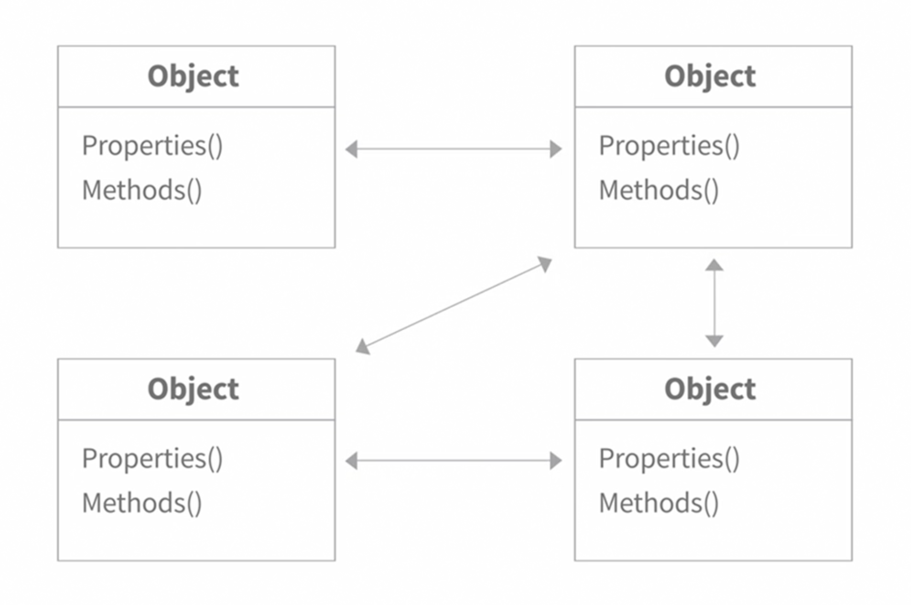
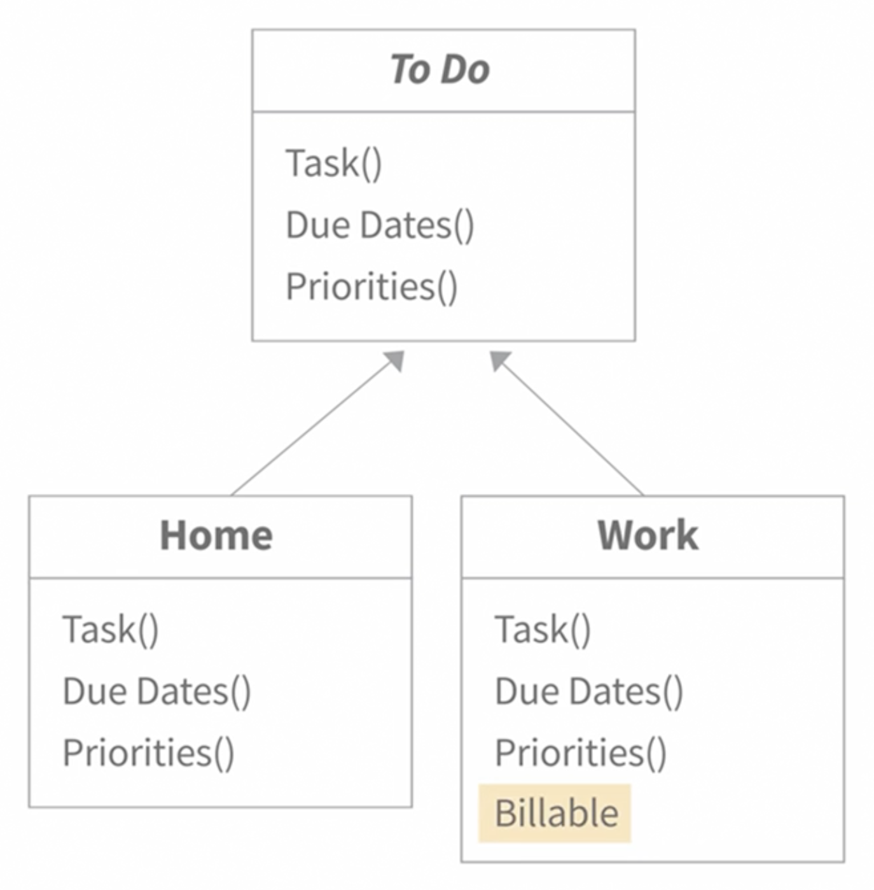

# Summary

-   **Object-Oriented Programming (OOP):** OOP is a programming paradigm that organizes code into objects, making it easier to manage and maintain.

-   **Attributes and Methods:** Objects have attributes (data) and methods (functions) that define their properties and behaviors.

-   **Classes and Objects:** A class acts as a blueprint for creating objects. Multiple objects can be created from the same class, each with its own unique data but sharing the same structure and behavior.

**Encapsulation:**

**Classes:**

